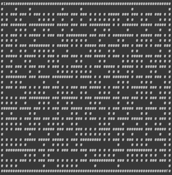
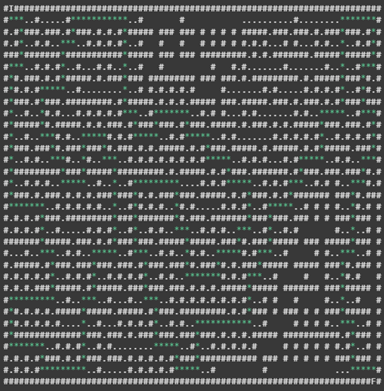

# 🧠 Resolução de Labirinto com Busca Cega (BFS)

> Trabalho de Inteligência Artificial - 2º ADS - FATEC Ourinhos  
> Alunos: Daniela Campos Rodrigues, Lucas Pontes Soares, Pedro Ramos Lima  
> Professor: Vinicius Godoy

---

## 📚 Contexto

A resolução de labirintos representa um desafio clássico em ambientes desconhecidos, comum em áreas como robótica, navegação autônoma e inteligência artificial. Este projeto aplica **busca cega por largura (BFS)** para encontrar um caminho do ponto de partida (I) até o destino (F) em um labirinto gerado aleatoriamente, sem utilizar heurísticas ou informações extras.

---

## 🎯 Objetivo

Implementar um algoritmo de **busca em largura** para resolver labirintos de forma eficiente, explorando o espaço de forma sistemática e garantindo a **solução mais curta** possível.

---

## ✅ Justificativa

Escolhemos a **busca em largura (BFS)** por:

- Garantir a solução (completa todos os caminhos possíveis).
- Ser ideal para encontrar o caminho mais curto.
- Evitar loops infinitos (diferente da busca em profundidade).
- Não exigir heurísticas ou informações externas (essencial em ambientes desconhecidos).

---

## 🛠️ Metodologia

1. **Pesquisa sobre geração de labirintos**.
2. Criação de um **pseudocódigo** base.
3. Implementação em **Python (Google Colab)**.
4. Geração aleatória do labirinto:
   - Representado no console com `#` (paredes) e espaços `' '` (caminhos).
5. Utilização da **busca em largura (BFS)**:
   - Visualização em tempo real com delays.
   - Versão otimizada sem delay para medir desempenho.
6. Código modular, comentado e organizado por funções.

---

## 🔍 Hipóteses

- Todos os labirintos gerados têm **solução garantida**.
- Pontos de início e fim são fixos por padrão, mas podem ser aleatórios para ampliar o desafio.
- Exploração de variantes com custo, heurísticas (A*) e restrições pode ser feita em trabalhos futuros.

---

## 📸 Exemplos Visuais

### 🧱 Labirinto Gerado

---

### 🔄 Labirinto em Resolução (Busca em Largura)

- `#`: parede  
- `.`: caminhos explorados  
- `*`: caminho final encontrado  

---

## 📊 Resultados

- O algoritmo encontra o **menor caminho** com sucesso.
- A versão com delay é útil para fins didáticos.
- A versão sem delay permite análises de performance.

---

## 📄 Estrutura do Código

- `gerar_labirinto()`: Cria o labirinto com base em escavação por DFS.
- `bfs()`: Aplica busca por largura para encontrar o caminho.
- `mostrar_labirinto()`: Imprime o labirinto no console.
- `main()`: Função principal de execução.

---

## 🧪 Testes e Avaliação

A busca foi testada em diferentes tamanhos de labirinto, e sua eficácia avaliada com base em:

- Tempo de execução
- Visualização clara
- Robustez em mapas aleatórios

---

## 📌 Considerações Finais

O projeto demonstra como técnicas simples de busca podem ser extremamente eficazes em resolver problemas complexos quando aplicadas corretamente. A **busca cega por largura** é um ótimo ponto de partida para entender algoritmos de navegação em IA.

---

## 🧠 Próximos Passos

- Implementar versões com heurística (como A*).
- Avaliar uso de busca bidirecional.
- Aplicações em contextos reais como rotas em mapas ou navegação de robôs.
